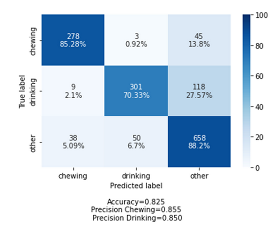

# Portfolio-Lucas-Pawlak
By: Lucas Pawlak

Student number: 21120854

Project name: Team Nourish

Project group:
- Florian Rumpold
- Marteen DeJoonge
- Lucas Palak

# Introduction

The teddy bear project wanted us to work on the recognition of eating and drinking sound for the people with dementia.
It'll be used to give a certain "quality of life" score to help the caretaker to know if the people with dementia need specific care or if it can live alone.

# Datacamp

<details><summary>Progress in DataCamp can be found here</summary>


</details>

# Reflection and Evaluation

<details><summary>Reflection on own contribution to the project</summary>

##### Situation
At the beginning of the project, we were 6 people working on it. Overtime 3 people dropped out so we had a bit of a hard time organizing ourselves. There were also the curfew and the lockdown in November and December that made things difficult.

##### Task
The main goal was to be able to have a model that detects eating and drinking sounds. We spend 4 months on it.
There wasn't a specific organization. Because we were a group of 3 people it sounded like a waste of time to create a hierarchy instead of working on equal ground.
I tried to put deadlines on the tasks we were all doing so we could deliver on time.

##### Actions
We did standups every other day to check if some process was made, if someone needed help or if we had to speed up our work because we were running short on time.

I tried to create a simple deep learning model with the Keras library to get the hang of it but we quickly switched to the PyTorch library and this model was obsolete. I worked on retrieving the dataset because our current one at the beginning wasn't good enough so we had to change midway. I also worked on the data preprocessing for the learning lab and for the project.
And of course, the research paper where I did 2 chapters and then helped to work on the others.

##### Result
In the beginning, it was hard, because we had to discover and learn a lot of things and our group got smaller and smaller, but after mid-October, everything went smoother and I think we were able to deliver a work that is serious even though some results are a bit of a letdown.

##### Reflection
Overall, I am satisfied with my contributions. I have done my work properly. I was able to help my teammates if needed.

The creation of the new database was very interesting and there was a lot of research on my part to find one that suits our needs.

Even though I think I could have done my work a bit better.
Sometimes due to a lack of motivation or just some events in my life, I delivered my work after the deadline. 
I think because of Covid and just doing data science only every week took a toll on my motivation.
That's wasn't very serious on my part.

For example, the learning lab I kept postponing because of the lack of motivation to do it.

---
</details>

<details><summary>Reflection on own learning objectives</summary>

##### Situation
The Data Science domain was almost completely new to me. I tried to do a deep learning model to check if an image of a number was pair or even, but it was way too hard for me to start with it and I quickly dropped the subject.
I'm experienced in programming in general but mostly nodeJs, C, or Rust. So all of the python notebooks, NumPy, data frame, etc... Was new to me.


##### Task
My task in this minor was to learn how data science works in general, like how to create a machine learning model, a deep learning model, tuning the hyperparameter, and all of the data preparation beforehand.

##### Actions
The first challenge was to get a proper Dataset, the first one we used wasn't good and we had to change. After this, there was a lot of trying things to understand how it works under the hood.

The Datacamp course was also a great way to understand how each python library that is used in the Data Science domain works.

In the end, after my small own experimentation, I didn't make the model currently in the research paper I preferred to switch on a more conceptual approach like finding a lot of research papers that could help the current model.

##### Result
At the end of this semester, my python skill improved quite a lot!
Especially in the data visualization part, data augmentation, and data preprocessing.
And for the most important part now I know how to implement some deep learning models. I'm not a Data Scientist expert but now I have a grasp of how things work.

##### Reflection
Overall I think this minor was a great experience!

The first months were difficult to get into it because my group and I decided to directly try some deep learning models so we skipped a lot of steps to go directly to this part.
I think it was a mistake because we struggled a lot at the beginning and we could have made the beginning of the semester a bit easier if we tried basic machine learning before jumping right into deep learning (even though I think it's the most interesting part).

There also was the research paper that wasn't the "fun" part at all but it's the first time I had to do one and I think this experience gave me a deeper understanding of what it means to be part of a research project.

I acquired a lot of knowledge that is already useful for me in my programming career! 

---
</details>

<details><summary>Reflection on the group project as a whole</summary>

##### Situation
We started this minor, we were a group of 6 students on this project, one never showed up.
Another one left just after the 2nd or 3rd weeks, and again another one left after being 2 or 3months in the minor.
We turned from a quite diversified group to a 3 people group with 2 that studies computer science and the last that study physics.

We couldn't share a lot of new knowledge with each other because our domain of predilection was almost the same sadly.

##### Task
To complete our task we decided to use what the teacher advised us to do: The scrum Methodology.
We made a lot of sprints of 2 weeks so we could divide the big task into a smaller one that we could achieve inside the sprints.
Doing so helped us quite a lot because sometimes we didn't know where to start at all.


##### Actions
Since our group shortened quite a lot we didn't have the opportunity to do a lot of experimenting on our own because we needed to have at least one model working for our problem owner.
One person of our group was heavily into the tuning of the model, while another was more into the evaluation model and the data visualization and the research paper and I was into the research paper data preprocessing, finding a dataset, data augmentation, and creating the different powerPoint for the internal and external presentation.


##### Result
In the end, we weren't able to create a lot of different models to compare to each other and choose the best one because we were short on manpower but we did make 2 big models.
The first one was a binary classifier that detects eating and the other sound then detects drinking and the other sounds.
The second one is the one we choose for our research paper. A Convolutional Neural Network that tries to detect eating and drinking and other sounds.  


##### Reflection
During the two-third of this minor, we were able to meet quite often, at least once or twice a week at the university to work together. 

But with the COVID-19 new cases increasing, the curfew and then the lockdown. It was not possible anymore to meet in person. I think it hurt a bit of our motivation because well... 
Working alone in our respective homes is not that fun Ahah especially for international students.

The good thing about being only 3 is that nobody really "slacked off" it also makes us quite efficient in our decision-making because there was a lot less talking.

Overall I am happy with what we were able to achieve as a group during this minor. I think being able to create a research paper with a not-perfect but working deep learning model with only 3 people that weren't experienced in the Data Science domain is something that we can be proud of!

---
</details>

# Research project

<details><summary>Task definition </summary>

This project is part of the Teddy Bear project and The Hague university of Applied Science.

People are more and more affected by dementia but the capacity of care doesn't increase at the same pace at all. The goal of the Smart Teddy Bear Project is to reduce the workload of the caretaker.
The Smart Teddy Bear project uses a Teddy bear stuffed with sensors to detect the quality of life score (QoL) of someone with dementia. With this QoL, the caretaker should be able to understand if the person needs daily care or if this person can live by himself without further assistance.

This QoL score is computed by detecting a lot of very specific information like emotion, eating and drinking, etc...
The Smart Teddy Project gave us the task to work on the eating and drinking detection part.
This raises the following research questions: `“Which machine learning model is optimal to detect eating and drinking sounds from audio?”`

---
</details>

<details><summary>Evaluation </summary>

While we were able to answer our research question, there is still a lot of improvements doable.

<details><summary>Having a more "real" dataset</summary>
Our current can answer our current research question but, for the Smart Teddy Project, it may not work that well. The teddy bear won't be able to retrieve such a clear sound of eating and drinking. 

#### Recommendation

One solution should be creating a homemade dataset with people eating and drinking normally and not 10cm away from the microphone.
</details>

<details><summary>Trying other model</summary>
We directly went to a CNN model and a binary classifier because of the lack of time and/or manpower. I don't know at all if, in the end, the usage of CNN was the best choice to do.

#### Recommendation
My recommendation is to try a lot more models in order which one seems to be the most promising one at first "glance".
</details>

<details><summary>Using cutlery sounds</summary>
The current model detects only eating and drinking sounds. One current issue is that we can have some false positives and in the context of this project false positives are something to avoid at all costs. It would raise the quality of life score of someone and make him able to live by himself even though it's not the case.

#### Recommendation
One way to prevent the false positive should be using the cutlery sounds to confirm if the person is eating or drinking.
It would make the model much more reliable.
</details>

---
</details>

<details><summary>Conclusions </summary>

At first, I wrote a conclusion in the paper but it was too "broad" and opened to many questions for the future group working on a similar problem.
We decided to cut this conclusion into 2 parts the first one is the recommendations chapter of our current paper and the second paper is the current conclusion chapter that Florian improved.

Here is the conclusion from the paper :
```In trying to find the best deep learning model to detect eating and drinking sounds, several
models were used. These can be divided into three categories: purely linear neural
networks, convolutional neural networks and transfer learning using ResNet models.
The linear models were the worst performers in all metrics. On its best epoch it achieved an
accuracy of only 66.4%.
The self-made CNN’s had a good curve in the accuracy and loss graphs and ended on an
overall accuracy of 82.5%, a precision of 85.5% on chewing and 85.5% on drinking and a
recall of 85.28% on chewing and 70.33% on drinking. As we prioritise precision over recall,
these results are very promising.
The ResNet models had a few epochs that exceeded the performance of the self-made
CNN’s. The best of these achieved an accuracy score of 83.6%. This is 1.4 percentage
points better than the best self-made CNN. However, as can be seen in figure 6, the
accuracy of the ResNet models varied heavily between epochs. The best performing model
had an epoch with an accuracy of 83.6% followed immediately by an epoch with an accuracy
8of only 24.4%. Because of this high variance, the transfer learning models are not our
recommendation, despite some good performances.
Considering this, our best model for detecting chewing and drinking sounds is a
Convolutional Neural Network with 2 Convolutional layers and 3 linear layers.
```
- The accuracy score:


- The confusion matrix:

 
 These two visualisation were made by Florian.

---
</details>

<details><summary>Planning </summary>

In the beginning of the project we directly planned to use Jira for our scrum board.

Each sprint was 2weeks long. At the start of each sprint we decided what was the main objectives of this sprint and we tried to create task so each member will assign themselve to a task to work on.
We were able to delete/create and add some information on each task while the sprint was ongoing.
Every other days we made daily standups where we would talk about what we've done, if we have any issues with the task, if we need help and if everything is fine and will be delivered on time.

At the beginning my role was to be the scrum master but as our group got reduced in half everyone working on the creation of each task during a sprint.
We lost a bit of organization in order to work a bit faster.

---
</details>

# Domain knowledge

<details><summary>Introduction of the subject field </summary>

The goal of this project was to detect eating and drinking sounds.
To do that we had to first retrieve a dataset with bunch of eating and drinking sounds.
The data had to go into some preprocessing function to clean and augment before turning them into a spectrogram and then feed it to our model.

---
</details>

<details><summary>Litterature research </summary>

##### Introduction

Most of the research paper that talked about detecting eating or drinkink used the mouvement detecting instead of the sound.
I decided to broaden our research to not only eating and drinking recognition but mainly sounds recognition to see how others detect sounds in general.

##### Eating and drinking Recognition ([source](https://www.ncbi.nlm.nih.gov/pmc/articles/PMC6631238/))
It was one of the first document I found online. Even though it use a gesture dectetion. This paper gaves us some direction in the project.
Especially with the binary classifier 

#### I hear you eat and speak ([source](https://journals.plos.org/plosone/article?id=10.1371/journal.pone.0154486))
With this paper I tried to ask the authors if they could share their dataset but they didnt gave it.

#### Sound event classification ([source](https://towardsdatascience.com/sound-event-classification-using-machine-learning-8768092beafc))
It was really helpful to understand how to work with sounds as a data scientist.

#### Converting sounds into images ([source](https://www.kaggle.com/rftexas/converting-sounds-into-images-a-general-guide))
In this project we decided to turn audio into a mel spectrogram and then feed it to the model. Thanks to this paper we were able to understand how to convert every soundfile into an images.

---
</details>

<details><summary>Explanation of Terminology, jargon and definitions </summary>

|Jargon|Explanation|
|------------|---------|
|CNN| Convolutional neural network is a neural network commonly used in visual imagery|.
|Confusion matrix| It's also known as an `error matrix`. It's a table where you can visualize the success rate of your current model. Each row of the matrix represents the instances in an actual class while each column represents the instances in a predicted class, or vice versa.|
|Layer| In deep learning a layer is a "part" of the whole model where it takes the information from the previous one and then passes the new information to the next layer to `learn`.|
|Resnet| Residual Network is a specific type of neural network that was found in 2015 by Kaiming He.|
|Hyperparameters| It's a parameter used before the data is observer/processed, they control the behavior of the training model. There is a lot of type of hyperparameters such as the Learning Rate, the number of Epochs, hidden layers...|
|Learning rate| It adjusts the weights of the models, it affects how quickly the model can find the best accuracy for the dataset.|
|Epochs| It tells the model how long does it has to train, if the epochs are 200 the model has to go through all of the training set 200 times.|
 

---
</details>

# Communication

<details><summary>Presentations </summary>

Another perks of being only 3 in a group, is that everybody had to make the presentations ahah.

I've presented 2 internal presentation myself and also the first external presentation.

I helped at making the powerpoint in every presentation.

---
</details>

<details><summary>Writing paper </summary>

I helped in every part of the research paper of course but my main contribution in it was:
- The introduction (which was improved by Marteen, another member of the group) [here](intro.png)
- Data preprocessing [here](preprocessing.png)
- Conclusion (which was further improved by Florian, another member of the group too) [old](oldConclusion.png) and the [new](newConclusion.png)
- Recommendations [here](recommendation.png)

---
</details>

<details><summary>List of Notebooks</summary>

- Python file to retrieve sounds to make the new dataset [here](NoteBook/dataFrame.py)
- Python file for the learning labs about data preprocessing [here](NoteBook/dataVizualisation.py)
- NoteBook about a small tutorial to learn how to work with audio [here](NoteBook/tutoAudio.ipynb)
- Modified python file to retrieve all of the different audio file for our dataset, made by Aoife McDonagh [here](NoteBook/process.py)

</details>

<details><summary>Completed Scrum Tasks</summary>


</details>
